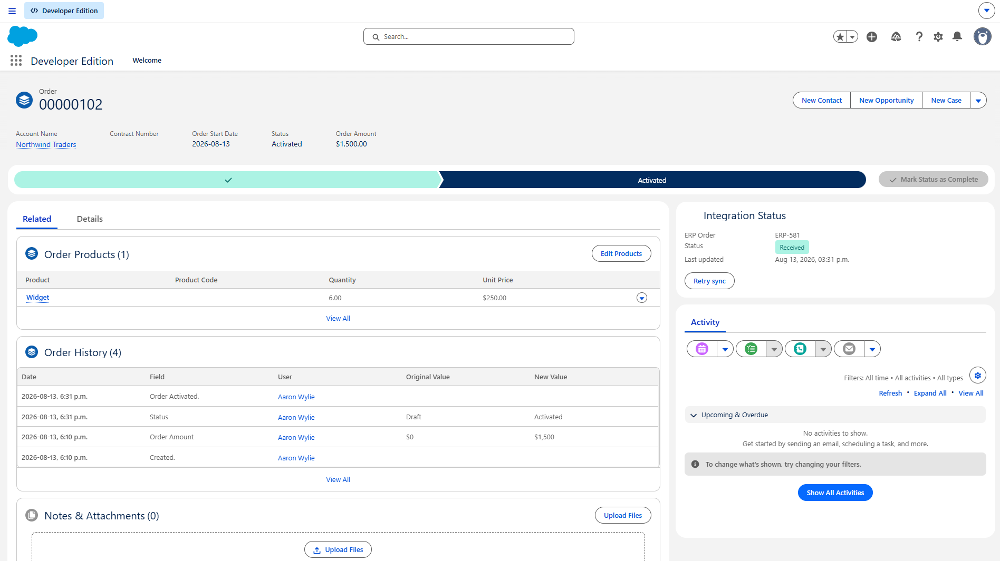
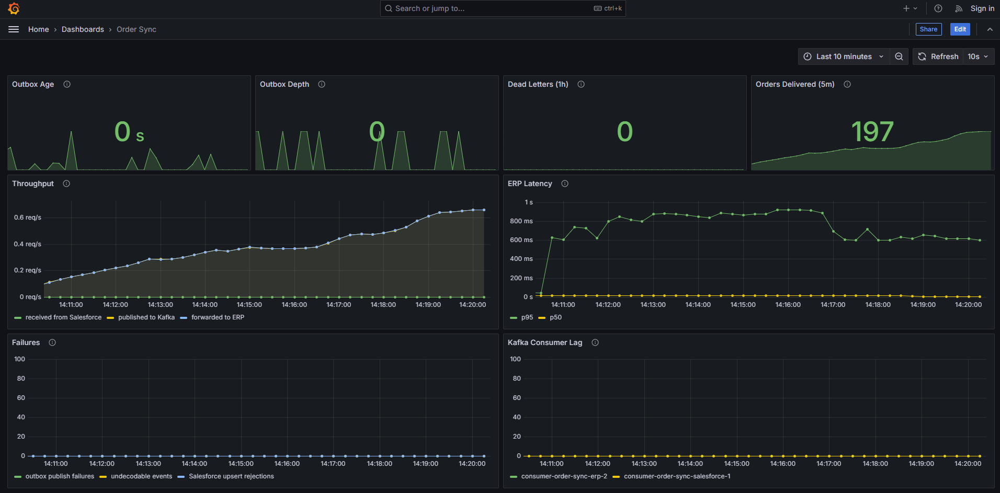

# sf-order-sync

## In plain language

A sales rep closes a deal in Salesforce and activates the order. Somewhere else in the
company sits the warehouse system, which needs to know about that order so someone can
pick the items off a shelf and ship them. When the parcel goes out, Salesforce needs to
hear about it too, so the rep can answer "where is my order?" without phoning the
warehouse.

The two systems cannot talk to each other directly. Salesforce is a cloud product with
strict limits on how often anything may call it; the warehouse system lives inside the
corporate network and is not reachable from outside. **This project is the piece in the
middle that carries the news both ways.**

Sending a message is the easy part. Almost all of this code exists for the moments when
something goes wrong:

- **The warehouse system is down for ten minutes.** Orders raised during that window
  cannot simply evaporate. They queue up and go through when it comes back.
- **Salesforce announces the same order twice.** It genuinely does this — the guarantee
  is "at least once", not "exactly once". The warehouse must not end up shipping two.
- **This service is restarted halfway through.** It has to resume from exactly where it
  stopped, without skipping orders or replaying ones already handled.
- **One order arrives malformed.** It must be set aside for a human, not left to block
  the hundred perfectly good orders queued behind it.
- **The service is offline all weekend.** Salesforce only remembers announcements for
  three days, so a separate nightly job goes and asks directly: "what changed while I
  was away?"

There is also a small panel on the Salesforce order screen showing whether an order
reached the warehouse, what its shipping status is, and a button to send it again — so
the question "did that actually go through?" gets answered where people already work,
rather than by asking an engineer to check the logs.

## What each piece of technology is doing here

**Building the service**

| | What it is for |
| --- | --- |
| **Kotlin** | The language the service is written in. Chosen over Java mainly because its type system distinguishes "this value might be missing" from "this value is always there", and the compiler refuses to let you forget the difference — which caught a real bug in this project before it ever ran. |
| **Spring Boot** | The scaffolding underneath: it starts the application, reads configuration, exposes the web endpoints, and connects the pieces together so that code does not have to be written by hand. |
| **Gradle** | Turns the source code into something runnable, and fetches the libraries it depends on. |

**Moving the messages**

| | What it is for |
| --- | --- |
| **Apache Kafka** | The queue in the middle. When the warehouse is unavailable, orders wait here rather than being lost, and go through when it returns. It also lets the two halves run at their own speed instead of one waiting on the other. |
| **PostgreSQL** | The service's memory. It records which announcements have already been handled, so nothing is processed twice, and holds outgoing messages until they are safely delivered. |
| **Flyway** | Creates and updates those database tables automatically on startup, so nobody has to run scripts by hand. |

**Talking to Salesforce**

| | What it is for |
| --- | --- |
| **Salesforce Pub/Sub API** | How Salesforce announces that something changed. The service listens on a permanently open connection rather than repeatedly asking "anything new?", and can resume from where it left off after a restart. |
| **Apex + Platform Events** | Code that runs inside Salesforce itself. When an order is activated, this is what publishes the announcement the service is listening for. |
| **Salesforce REST / Composite API** | The way back in. Updates are sent in batches of up to 200, because Salesforce limits how many times per day anything may call it — a limit a naive integration exhausts by mid-afternoon. |
| **Lightning Web Component** | The small panel on the order screen showing whether an order reached the warehouse, so a salesperson can check without asking an engineer. |

**Proving it works**

| | What it is for |
| --- | --- |
| **Cucumber** | Tests written as plain English scenarios — "a redelivered event is forwarded only once" — that non-developers can read and check for themselves. |
| **JUnit, Kotest, MockK** | The ordinary unit tests underneath those scenarios. |
| **Testcontainers** | Runs a genuine database and a genuine Kafka during testing, rather than pretend versions. Some behaviour only shows up against the real thing. |
| **WireMock** | A stand-in Salesforce and warehouse that can be told to fail on demand, so the recovery behaviour can be tested without breaking anything real. |
| **GitHub Actions** | Runs the whole test suite automatically on every change, on a clean machine. |

**Watching it run**

| | What it is for |
| --- | --- |
| **Prometheus + Grafana** | Collects and graphs the numbers that matter — how many orders are waiting, how long the oldest one has waited, what is failing. The second of those is the one worth an alert. |
| **OpenTelemetry + Jaeger** | Follows a single order all the way through, so a question like "where did this one get stuck?" has an answer instead of a guess. |
| **Docker** | Runs the supporting pieces above on a laptop with one command. Optional — there is a script that installs them directly if Docker is unavailable. |

## What it looks like running

### Where it starts: a salesperson, in Salesforce



An order for Northwind Traders — six Widgets, $1,500 — moments after the rep clicked it
from **Draft** to **Activated**. That single click is the entire trigger for everything
else in this project. Nobody filled in a second system, pressed a sync button, or told
the warehouse.

The **Integration Status** panel on the right is the only part of this page that knows
an integration exists. It reports that the warehouse has the order and calls it
**ERP-581**, and that this was true as of 3:31pm. If it had not arrived, that badge
would say so, and the **Retry sync** button beside it lets the rep resend without
raising a ticket.

Everything between those two facts — the click and the badge — took **156 milliseconds**:

```
15:31:30.210  Published order 00000102 in status ACTIVATED
15:31:30.273  Sending order 00000102 to the ERP
15:31:30.366  Order 00000102 is ERP-581 in the ERP
```

For the rep, though, the interesting number is that they never had to know any of it
happened. A well-behaved integration is one nobody notices, and the panel exists only
because "did that actually go through?" is a question people will ask regardless — it is
better answered on the screen they already work in than by an engineer reading logs.

> The panel reads the record through Lightning Data Service rather than a server call.
> An earlier version queried Apex and confidently displayed "this order is still a
> draft" on a page whose own header read *Activated* — a `@wire` to Apex only re-runs
> when its arguments change, and the record id does not change when the record does.

### What happens behind it



The same journey, seen from the machinery — a ten minute window from a run of 450
orders, arriving at a deliberately uneven rate. Every order reached the ERP. Nothing was
lost, and nothing arrived twice.

Reading it panel by panel, and why each says what it says:

**Outbox Age — `0s`.** The age of the oldest order still waiting to be sent. This is the
single most important number here and the one worth an alert. The sparkline shows it
lifting briefly during bursts and dropping straight back — which is the healthy shape.
What matters is not that it touches zero but that it *returns* there. A line that
climbs and stays up means orders have stopped reaching the ERP, and it shows here long
before anyone in the business notices.

**Outbox Depth — `0`.** How many orders are queued right now. Deliberately *not* the
alert: the spikes in its sparkline are bursts of arriving work being absorbed and
drained, exactly as intended. Depth alone is noise. Depth that stays high *while the
age is also climbing* is the real signal, which is why the two sit side by side.

**Dead Letters (1h) — `0`.** Orders that could not be delivered and have been set aside
for a human. Anything above zero turns this tile red and needs attention.

**Orders Delivered (5m) — `197`.** Orders successfully pushed into the ERP over the last
five minutes.

**Throughput.** The panel carrying the actual argument. Orders published to Kafka and
orders delivered to the ERP climb together to roughly 0.65/s and stay locked to each
other for the whole run. Work entering equals work leaving. A gap opening between those
two lines would mean orders accumulating at that stage — there isn't one. (The
"received from Salesforce" line sits at zero because this run was driven synthetically
rather than by live platform events; the live path is covered separately below.)

**ERP Latency.** Time to land one order in the ERP, at the median and the 95th
percentile. The median is pinned at zero — the stand-in ERP does no real work — while
the p95 wanders between 600ms and 900ms. **That gap is the measurement environment, not
the service**: a laptop running Kafka, Postgres, two JVMs, Prometheus and Grafana at
once produces exactly this kind of tail. These are not performance numbers; see
*Not done* below.

**Failures — flat at zero.** Publish failures, undecodable events and Salesforce
rejections, all absent across the window.

**Kafka Consumer Lag — flat at zero.** How far behind the consumers are running. Flat
at zero means they keep pace with production in real time rather than building a
backlog. This is the same claim the Throughput panel makes, confirmed independently
from the broker's side rather than the application's — which is why both are shown.

> Reproduce it with `.\ops\local\generate-load.ps1`, which writes orders into the outbox
> and lets the real relay, Kafka and consumer do the rest. No metrics are fabricated:
> every number above moved for the same reason it would in production. The default
> profile varies the arrival rate rather than spacing orders evenly, so the queue is
> exercised at genuinely different depths instead of one steady trickle.

## Technically

Bidirectional integration between Salesforce and an ERP, over Kafka.

Salesforce owns Orders. The ERP owns fulfillment. Neither calls the other: a Kotlin /
Spring Boot service brokers both directions, dealing with the parts that make this
genuinely hard — at-least-once delivery, replay after downtime, poison messages, and
Salesforce's API governor limits.

Full design in [docs/architecture.md](docs/architecture.md). Org setup in
[docs/salesforce-setup.md](docs/salesforce-setup.md).

## Layout

```
services/order-sync/     Kotlin + Spring Boot — the integration service
services/mock-erp/       Stand-in for Oracle EBS, so compose has a real HTTP peer
salesforce/              SFDX package: Order_Change__e, Apex, LWC status panel
ops/                     Prometheus, Grafana dashboard, Dockerfiles
docs/                    Architecture, ADRs, org setup
```

## Prerequisites

- JDK 17
- Docker — for compose and for the Testcontainers-backed tests
- A Salesforce Developer Edition org, for the live Pub/Sub path
- The Salesforce CLI, to deploy `salesforce/`:

  ```bash
  npm install --global @salesforce/cli
  ```

  Note that `sf` commands must be run from inside `salesforce/` — that is where
  `sfdx-project.json` lives, and the CLI resolves the project from the working
  directory.

## Tests

Two lanes, deliberately:

```bash
./gradlew test              # acceptance + unit + WireMock. No Docker. Seconds.
./gradlew integrationTest   # Testcontainers: real Postgres, real Kafka. Needs Docker.
./gradlew check             # both
```

The split exists so a developer without a Docker daemon still gets a real signal
instead of a hang. CI runs `check`.

## Running locally

```bash
docker compose up -d
./gradlew :services:mock-erp:bootRun &
./gradlew :services:order-sync:bootRun
```

### Without Docker

Docker is convenience, not architecture. If the daemon will not start, run Postgres and
Kafka natively instead:

```powershell
.\ops\local\local-infra.ps1 install   # one time, ~3 min
.\ops\local\local-infra.ps1 start     # Postgres on 5433, Kafka on 9092, topics created
.\ops\local\run-services.ps1 start    # both Spring services, from jars
.\ops\local\run-services.ps1 logs     # tail order-sync
```

Postgres runs on **5433**, not the default, so it cannot collide with a PostgreSQL
already installed on the machine. Set `DB_URL=jdbc:postgresql://localhost:5433/ordersync`
in `.env` to match.

Everything lands in a gitignored `.local/`. No administrator rights, no installer, no
Windows services — deleting `.local/` undoes it completely. It also uses noticeably less
memory than Docker Desktop.

What you give up: Kafka UI, Prometheus, Grafana and Jaeger are not started. Metrics are
still exposed at `/actuator/prometheus`, and `.local/kafka/bin/windows/kafka-console-consumer.bat`
reads topics from the command line.

The one thing that genuinely needs Docker is `./gradlew integrationTest`, since
Testcontainers has no substitute. CI runs that job on every push, so it stays covered.

| Service | URL |
| --- | --- |
| order-sync | http://localhost:8080/actuator/health |
| mock-erp | http://localhost:8081/api/orders |
| Kafka UI | http://localhost:8085 |
| Prometheus | http://localhost:9090 |
| Grafana | http://localhost:3000 (anonymous, dashboard pre-provisioned) |
| Jaeger | http://localhost:16686 |

The service starts without Salesforce credentials — `ordersync.salesforce.enabled`
defaults to false, so the Kafka and ERP halves run standalone. Set `SF_ENABLED=true`
once the org is configured.

### Operator endpoints

```bash
curl localhost:8080/admin/outbox                          # depth and oldest-row age
curl -XPOST localhost:8080/admin/dlq/orders/replay?max=50 # drain the DLQ back
```

## Deploying the Salesforce package

```bash
cd salesforce
sf org login web --alias ordersync-dev
sf project deploy start --target-org ordersync-dev
sf apex run test --target-org ordersync-dev --code-coverage --result-format human
```

Then drop the **Integration Status** LWC onto the Order record page in the Lightning
App Builder.

## How this repo is built

Acceptance criteria come first. Each slice began by writing the Gherkin scenarios and a
stub that throws, confirming the suite failed for the right reason, and only then
implementing until it passed.

**The git history does not show that**, and it is worth being straight about why: the
project was built in a single working session and committed at the end, so the initial
import is thematic rather than a red-then-green sequence. If you want the history as
evidence rather than the process, the commits from here forward are the honest place to
look for it.

What the code does still show is the boundary that made test-first practical: business
rules live in `com.ordersync.domain`, which has no Spring, Kafka or JDBC imports. That is
what lets the acceptance suite run against in-memory adapters in milliseconds while the
adapters get their own contract tests against real infrastructure.

## What is built

| Slice | |
| --- | --- |
| 1 | `OrderChangeProcessor` — dedupe, filter, translate, checkpoint |
| 2 | Postgres adapters, Flyway migrations, Testcontainers contract tests |
| 3 | Outbox relay to `orders.v1`, depth and age gauges |
| 4 | ERP consumer, retry classification, DLQ, replay endpoint |
| 5 | Pub/Sub API gRPC client, Avro decoding, replay resume |
| 6 | Reverse flow: fulfillment webhook, batch consumer, Composite API upsert |
| 7 | OpenTelemetry tracing, Grafana dashboard |
| 8 | Reconciliation job for expired replay windows |
| 9 | LWC integration status panel |

### Verified against a live org

Both directions have run end to end against a real Developer Edition org:

```
Fetching Avro schema b-kI41QbXxY_7Nmduhsn_g
Published order 00000101 in status ACTIVATED
Order 00000101 is ERP-1 in the ERP
Applied 1 of 1 fulfillment updates
```

Salesforce → gRPC subscription → Avro decode → outbox → Kafka → ERP, and the return
leg back into Salesforce via the Composite API. The Apex package deploys clean with 13
tests passing at 93% org-wide coverage.

That exercise earned its keep. It found a defect no test would have caught, because
every test mocks one side: nothing wrote the ERP's identifier back into Salesforce, so
the two systems shared no key, and every fulfillment update failed with
`REQUIRED_FIELD_MISSING: Select an account` — an upsert with nothing to match on
silently becomes an insert.

### Not done

- No authentication on the `/admin` endpoints. Fine for a demo stack on localhost, not
  for anything reachable from elsewhere.
- The LWC is deployed but not yet placed on the Order record page; that is a
  Lightning App Builder step.
- **No load testing.** The latency figures in the dashboard above were taken on a
  developer laptop running every component at once, and are not a performance claim.
  Real numbers would need isolated hardware.
